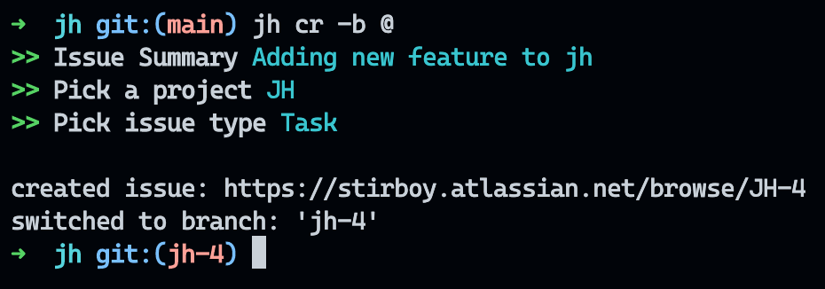

# jh

`jh` is a command tool utility to create jira issues right from the terminal



## Installation

1. Verify that you have Go 1.19+ installed

   ```sh
   $ go version
   ```

   If `go` is not installed, follow instructions on [the Go website](https://golang.org/doc/install).

2. Clone this repository

   ```sh
   $ git clone https://github.com/stirboy/jh jh
   $ cd jh
   ```

3. Build and install

   ```sh
   
   $ go install

   ```

4. You are good to go. Type `jh` to see how to use it ;)

    ```sh

    $ jh


    ```
